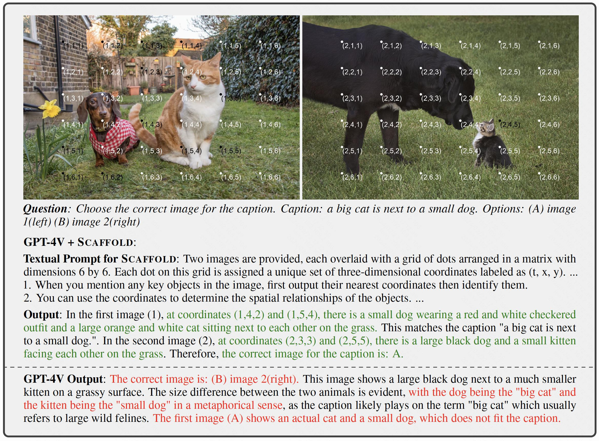
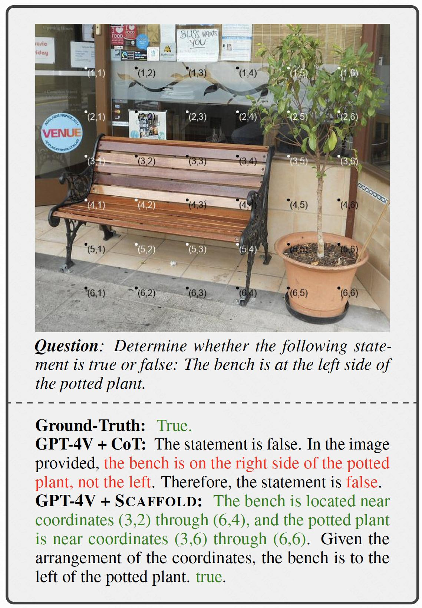
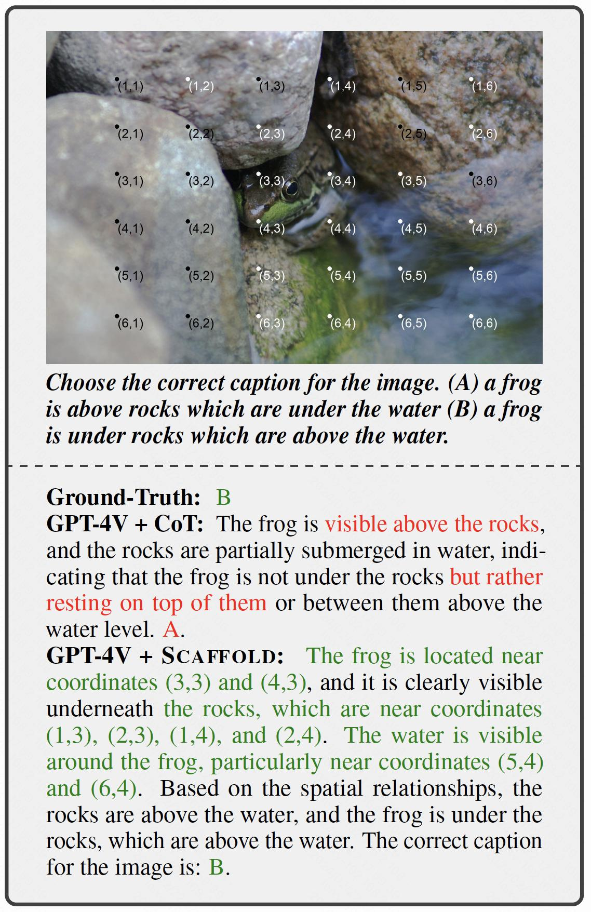
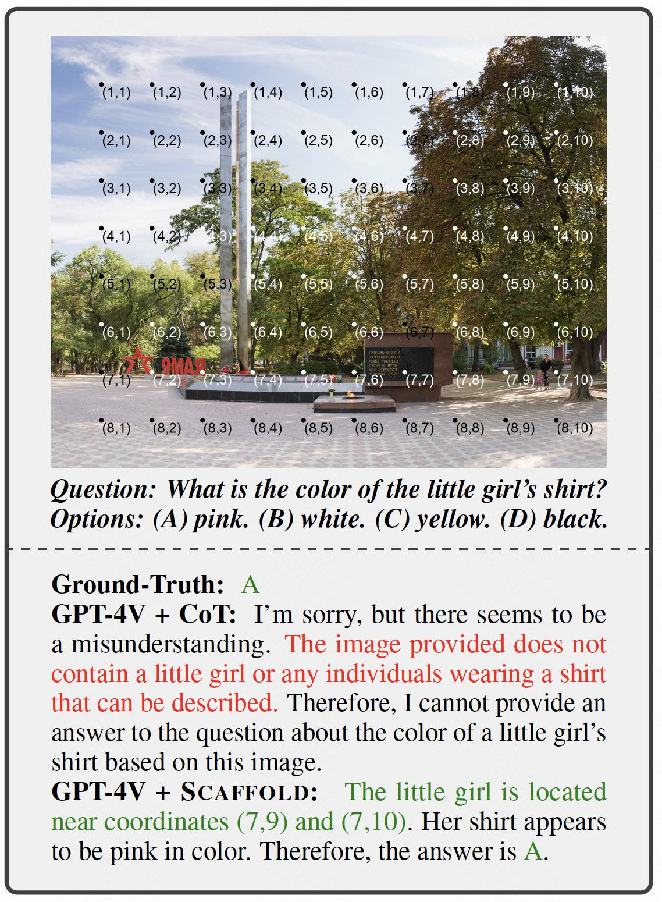
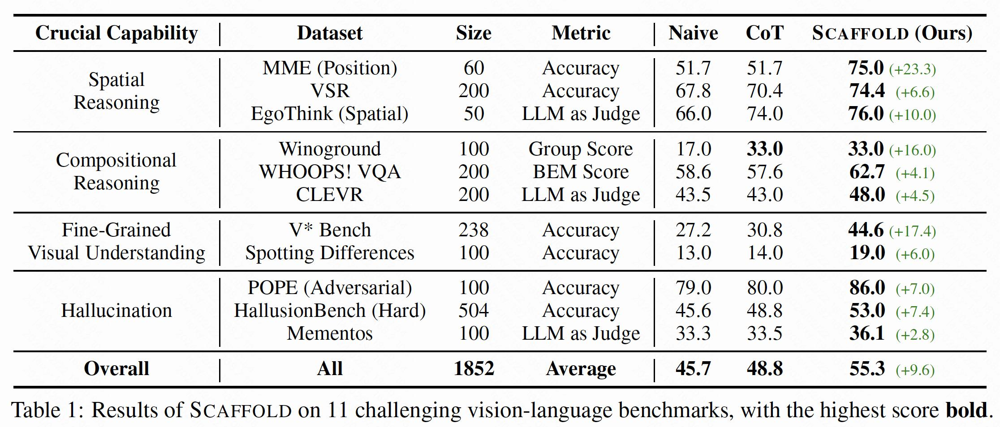
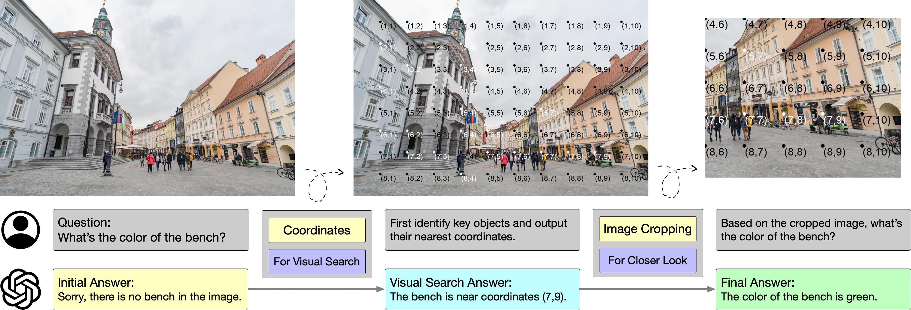
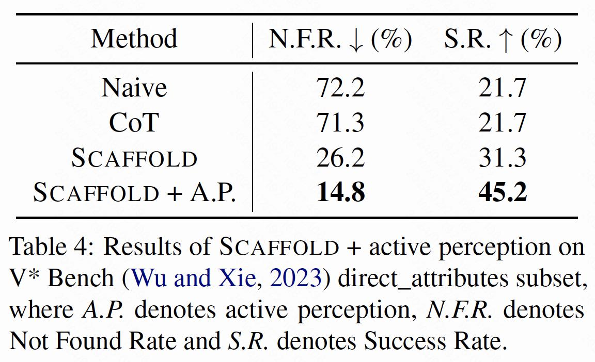

State-of-the-art Large Multi-Modal Models (LMMs) have demonstrated exceptional capabilities in vision-language tasks. Despite their advanced functionalities, the performances of LMMs are still limited in challenging scenarios that require complex reasoning with multiple levels of visual information. Existing prompting techniques for LMMs focus on either improving textual reasoning or leveraging tools for image preprocessing, lacking a simple and general visual prompting scheme to promote vision-language coordination in LMMs. In this work, we propose Scaffold prompting that scaffolds coordinates to promote vision-language coordination. Specifically, Scaffold overlays a dot matrix within the image as visual information anchors and leverages multi-dimensional coordinates as textual positional references. Extensive experiments on a wide range of challenging vision-language tasks demonstrate the superiority of Scaffold over GPT-4V with the textual CoT prompting.

## ⚙️ Scaffold Prompting

   <div style="text-align:center;">
      
   </div>

Scaffold is a simple and versatile visual prompting scheme to promote the coordination between vision and language in LMMs. Scaffold overlays a dot matrix onto the input image, and each dot is labeled with its multi-dimensional Cartesian coordinate. The dot matrix on the image forms the scaffold that indicates relative visual positions for LMMs. The overlaid coordinates are also included in the textual prompt, which explicitly strengthens the connection between visual and textual information for LMMs. The LMMs are thus steered to leverage the coordinates to solve different vision-language tasks. In this way, Scaffold provides a scaffold to promote vision-language coordination in LMMs. 

**Visually**, we enhance each input image with a uniformly distributed rectangular dot matrix, where each dot is labeled with multi-dimensional Cartesian coordinates. These dots serve as visual positional anchors, while their coordinates are utilized as textual references in textual responses. 

1. *Visual Anchor Implementation:* We select rectangular dot matrices as our visual anchor due to their simplicity, flexibility in textual description, and potential adaptability to image sequences.
2. *Coordinates Implementation:* For our approach, we use multi-dimensional Cartesian coordinates due to its simplicity and clarity. For a single image, we assign two-dimensional coordinates (x,y) to each dot, representing its relative visual position. For image sequences, we extend these coordinates to three-dimensional (t,x,y), allowing for differentiation between images and enhancing temporal perception.
3. *Other Factors:* For simplicity, we employ a 6 * 6 matrix for general vision-language tasks and enlarges the size for fine-grained visual understanding tasks. Additionally, the coordinates are designed to be recognizable by LMMs using their OCR capabilities. Consequently, we color each dot in either black or white according to its contrast against the background.

**Textually,**  we prepend textual guidance to task instructions for LMMs. This includes a brief description of the dot matrices and coordinates, accompanied by several general guidelines for their effective use. They possess the following chracteristics: 

1. *Conciseness:* The textual guidance is deliberately brief and clear, ensuring easy comprehension. 
2. *Generality:* Designed to be universally applicable, these guidelines are not specific to any particular scenario, making them suitable for a wide range of vision-language tasks. 
3. *Extensibility:* The guidelines are semantically independent, allowing for the seamless addition of more tailored instructions based on different scenarios. 
4. *Compositionality:* The prepended texts can be easily combined with other prompting methods, such as zero-shot ([Kojima et al., 2022](https://arxiv.org/abs/2205.11916)) or compositional CoT ([Mitra et al., 2023](https://arxiv.org/abs/2311.17076)).

## 🚀 Use Cases

Here are some cases from our experiments, illustrating the functions of Scaffold prompting.

<div style="display:flex; justify-content:space-between; align-items:center;">
  
  
  
</div>

## 📂 Experiments

To demonstrate the effectiveness of Scaffold, we conduct extensive experiments on top of GPT-4V on a range of challenging vision-language tasks, including *Spatial Reasoning*, *Compositional Reasoning*, *Fine-Grained Visual Understanding* and *Hallucination*. For each task, we select several benchmarks for an extensive evaluation.

### Benchmarks

**Spatial Reasoning** evaluates LMM capability to infer spatial relationships between objects.  
1. *MME (Position split)* ([Fu et al., 2023a](https://arxiv.org/abs/2306.13394)) is a subset of the MME comprehensive evaluation suite for LMMs to infer object positions.
2. *Visual Spatial Reasoning (VSR)* ([Liu et al., 2023a](https://arxiv.org/abs/2205.00363))  challenges LMMs with 66 types of spatial relations to verify spatial propositions.
3. *EgoThink (Spatial split)* ([Cheng et al., 2023](https://arxiv.org/abs/2311.15596)) tests the spatial reasoning ability of LMMs from a first-person perspective.

**Compositional Reasoning** requires LMMs to identify object attributes and their interrelations. 
1. *Winoground* ([Thrush et al., 2022](https://arxiv.org/abs/2204.03162)) is a challenging benchmark that necessitates compositional reasoning of LMMs to match images with captions, reformulated as binary choice questions for our evaluation.
2. *WHOOPS! VQA* ([Bitton-Guetta et al., 2023](https://arxiv.org/abs/2303.07274)) involves compositional reasoning over commonsense-defying images.
3. *CLEVR* ([Johnson et al., 2017](https://arxiv.org/abs/1612.06890)) is designed for assessing compositional reasoning in program-generated scenes.

**Fine-Grained Visual Understanding** requires LMMs to perform visual search and precisely perceive fine-grained visual details.  
1. *V* Bench* ([Wu and Xie, 2023](https://arxiv.org/abs/2312.14135)) requires LMMs to identify and reason with fine-grained visual details in high-resolution images. 
2. *Spotting Differences* ([CrazyGames](https://www.crazygames.com/game/find-the-difference
)) is our newly-collected dataset challenging LMMs to find and pinpoint differences between two similar images.

**Hallucination** measures the tendency of LMMs to generate hallucinatory or illusory perceptions. 
1. *POPE (Adversarial Subset)* ([Li et al., 2023](https://arxiv.org/abs/2305.10355)) assesses object hallucination by querying the existence of specific objects.
2. *HallusionBench* ([Guan et al., 2023](https://arxiv.org/abs/2310.14566)) consists of meticulously crafted images to measure hallucination and visual illusion in LMMs.
3. *Mementos* ([Wang et al., 2024](https://arxiv.org/abs/2401.10529)) evaluates LMM to conduct precise reasoning over image sequences and measures their performances in terms of object and behavior hallucinations.

### Results

   <div style="text-align:center;">
      
   </div>

The results demonstrate that Scaffold significantly enhances the visual capabilities of LMMs, surpassing zero-shot CoT in most evaluated benchmarks. With naive and textual CoT prompting averaging 45.7 and 48.8 respectively, Scaffold successfully obtains an overall improvement of 9.6.


## Combined with Active Perception

In complex visual environments, humans would proactively engage with their surroundings to enhance scene understanding, like zooming in or changing perspectives. Similarly, we recognize that LMMs should possess such capabilities in realistic scenarios and propose that Scaffold can function as a scaffold for effective active perception. 

   <div style="text-align:center;">
      
   </div>

To validate this, we integrate Scaffold with active perception in the experiments on the direct_attributes subset of V* Bench, which requires LMMs to perceive fine-grained details in high-resolution images. We adopt two metrics to measure LMM performance, including *Not Found Rate* representing the percentage of invalid responses, and *Success Rate* representing the percentage of correct responses. 

   <div style="text-align:center;">
      
   </div>

Scaffold prompting combined with active perception unfolds in two phases: initial visual search to locate the target details, followed by cropping the image around the pinpointed coordinates to closely examine and identify the target attributes. The results reveal a performance enhancement of 14.1% compared with Scaffold alone, underscoring the utility of coordinates in facilitating active perception.

## 👏 Citation

```
@article{lei2024scaffolding,
  title={Scaffolding Coordinates to Promote Vision-Language Coordination in Large Multi-Modal Models},
  author={Xuanyu Lei and Zonghan Yang and Xinrui Chen and Peng Li and Yang Liu},
  journal={arXiv preprint arXiv:2402.12058},
  year={2024},
}
```
